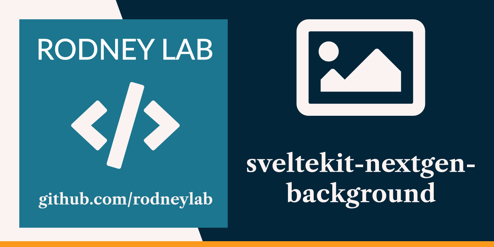

<p align="center">
  <a aria-label="Open Rodney Lab site" href="https://rodneylab.com" rel="nofollow noopener noreferrer">
    
  </a>
</p>
<h1 align="center">
  SvelteKit NextGen Background Image
</h1>

[](https://app.netlify.com/sites/inspiring-heyrovsky-49f468/deploys)

# sveltekit-nextgen-background

[](https://open.vscode.dev/rodneylab/sveltekit-nextgen-background)

SvelteKit demo code for adding a NextGen background image to a site page with a JPEG or PNG fallback for older browsers.

## Building and previewing the site

If you're seeing this, you've probably already done this step. Congrats!

```bash
git clone https://github.com/rodneylab/sveltekit-nextgen-background.git my-new-mdsvex-blog
cd my-new-mdsvex-blog
pnpm install # or npm install
pnpm run dev
```

## Building

```bash
pnpm run build
```

> You can preview the built app with `pnpm run preview`, regardless of whether you installed an adapter. This should _not_ be used to serve your app in production.
